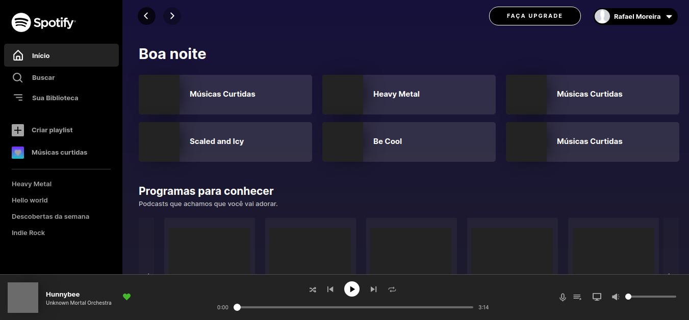
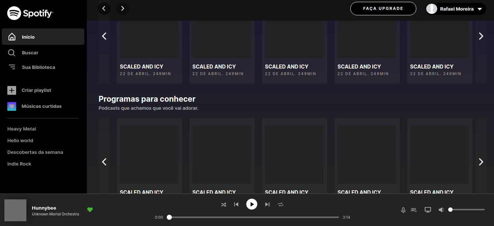
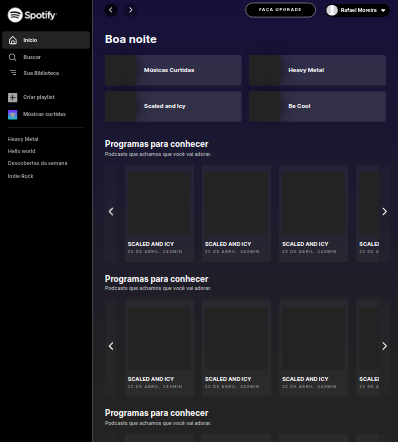
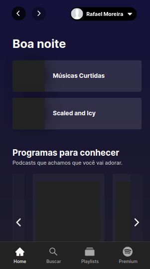

# Clone UI do Spotify! :musical_note:
O projeto foi feito com o propósito de estudar mais sobre como funciona CSS3 e o uso do mesmo com componentização em React.js, como efeitos e animações de scroll.
Fiz algumas alterações quanto ao original pois o mesmo não possui botões de scroll nos seus conteúdos, como também suporte responsivo para web, o original não possui responsividade justamente por ter um app nas lojas mobile. No projeto utilizei a biblioteca react-icons pra a implementação dos icones no projeto. Segue abaixo imagens do projeto:

## Imagens do projeto em ambiente desktop: :computer:

## Imagens do projeto em dispositivos menores: :iphone:

## Rodando o projeto

Para clonar o projeto, basta usar o seguinte comando:

### `git clone` + o link do repositorio

Depois de ter clonado o repositório, rode o seguinte comando para baixar todas as dependêcias do projeto:

### `npm install`

OBS: Pode ser que o projeto contenha erros dependendo da versão npm que você tem na sua máquina, para a correção de possiveis erros como esse, rode o seguinte comando: 

### `npm audit fix`

Pronto, agora é só rodar o projeto direto da sua máquina! :wink:

Use o seguinte comando:

### `npm start`
